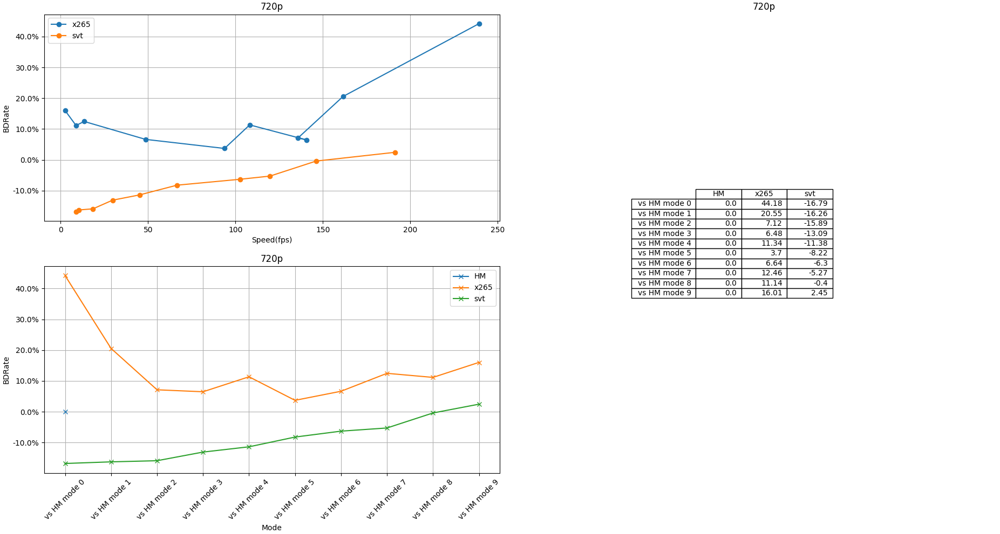
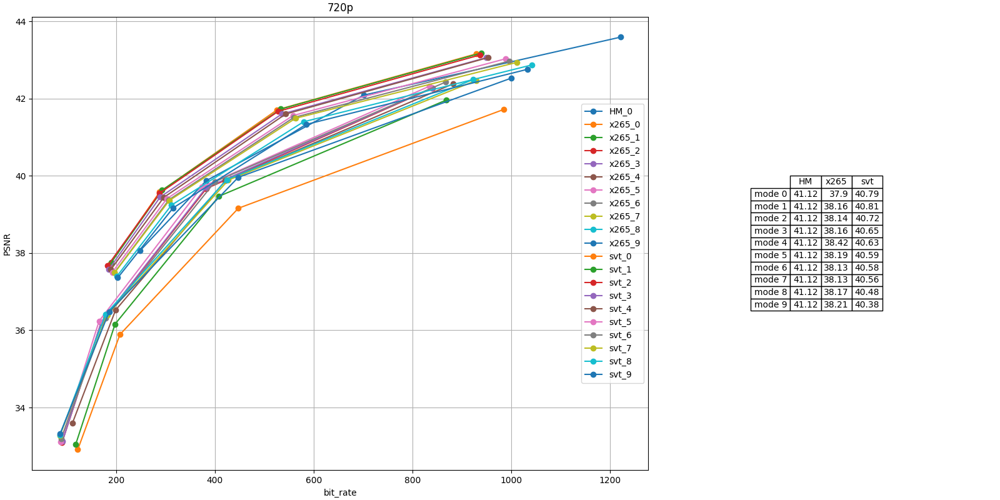

codec-DBDR-analyzer-tool
====================================
this tool can help you to analysis different codec encode Quality,it's basically like a automatic testing tool. it can execute different encoder with some test video sequence at same time, then generate the DBDR and bit rate line chart, so show you the codec quality.  

## **Install direction**

        sudo apt update
        sudo apt upgrade
        #  installing python 2.7 and pip for it
        sudo apt install python2.7 python-pip
        pip install numpy, scipy, pandas, matplotlib
        #  if your environment got proxy, please use
        #  pip istall …………  --proxy yourproxy
	(or sudo apt-get install python-numpy python-scipy python-matplotlib ipython ipython-notebook python-pandas python-sympy python-nose)

because this tool will compare different encoders, like HM/X265/SVT_HEVC/x264/av1， so you have to garentee your environment set up those encoders
        
        download HM:
            https://hevc.hhi.fraunhofer.de/svn/svn_HEVCSoftware/tags/
            (you should download by SVN)
        download x265:
            https://bitbucket.org/multicoreware/x265/downloads/
            (and you can see more infomation about x265 on site:
                https://bitbucket.org/multicoreware/x265/wiki/Home)
        download SVT-HEVC
            https://github.com/OpenVisualCloud/SVT-HEVC

## **Prepare configure**
before you start to surf the tool, you have to do some prepare work.
open OptionDictionary.py, then change the execute path to your locate path.

for example:

        exec_path = {
            'HM': **yourHM locate path**/HM-16.1/bin/,
            'x265': **yourx265 locate path**/x265/build/linux/,
            'svt': **yoursvt locate path**/SVT-HEVC/Bin/Release/
        }

        proxy = **the path you want to save temp file**

        
        TestSequencePath = **the test file url saved on a .csv file**

then, you have to add your test file url to test.csv, it could be yuv file or y4m file.

when you fix configure, you can let the this tool run. 

## **Start program**

        python exec.py

then you will get the DBDR diagram, they will be saved at your temp path, and divide by date.

## **change encode paramters**
for test different encoders quality , you may need to modify their encode paramters.you can modify them on the OptionDictionary.py file
 for example:       
        
    # test encoder and command line. it will be  QP, command line,
    # encoder name, codec name, instance name,
    # is read from database(you can use 'read' or 'execute')

    codec = [[[25, 29, 34, 38], './TAppEncoderStatic -c %s -fr 60 -f 10000' % HM_cfg_Path, 'HM', '265', 'testmode', 'read'],
                [[29, 35, 42, 48], './x265 --fps 60', 'x265', '265', 'testmode', 'read'],
                [[22, 28, 34, 40], './SvtHevcEncApp', 'svt', 
                [[22, 28, 34, 40], './aomenc --threads=64', 'AV1', 'AV1', 'testmode', 'read'],
                [[22, 28, 34, 40], './x264', 'x264', '264', 'testmode', 'read'],
]
        

you can add more test encode here, and their command line with your perfer parameter

Ps:because HM encode paramter is writen on .cfg file, so you have to sure this option is match to .cfg file.

### **example**

based on myself environment,test one y4m file:

	$ python exec.py
result show:

