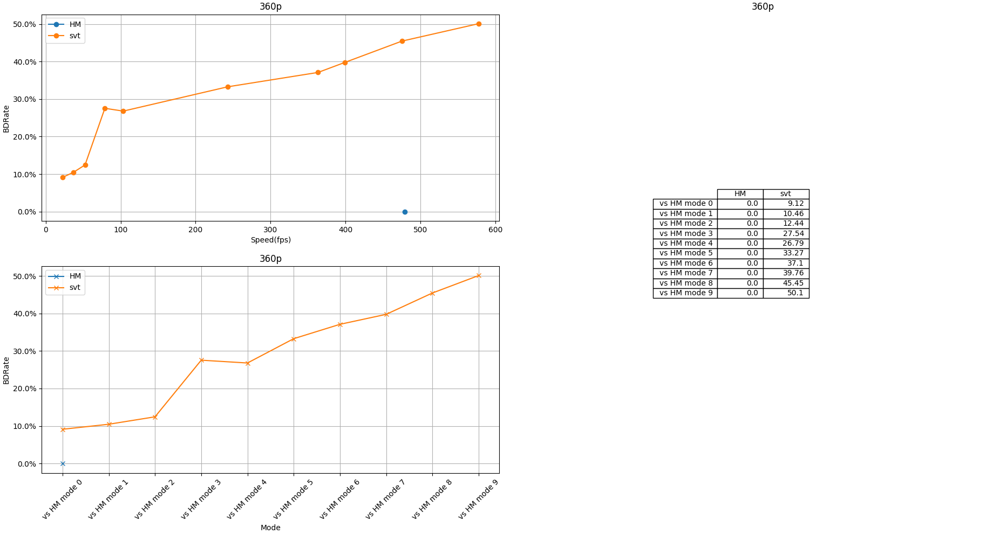

codec-DBDR-analyzer-tool
====================================
this tool can help you to analysis different codec encode Quality 

## **Install direction**

        sudo apt update
        sudo apt upgrade
        #installing python 2.7 and pip for it
        sudo apt install python2.7 python-pip
        pip install numpy
        pip install <other missing moduel>

because this tool will use HM/X265/SVT_HEVC， so you have to garentee your environment set up those encoders
        
        download HM:
            https://hevc.hhi.fraunhofer.de/svn/svn_HEVCSoftware/tags/
            (you should download by SVN)
        download x265:
            https://bitbucket.org/multicoreware/x265/downloads/
            (and you can see more infomation about x265 on site:
                https://bitbucket.org/multicoreware/x265/wiki/Home)
        download SVT-HEVC
            https://github.com/OpenVisualCloud/SVT-HEVC

## **Prepare configure**
before you start to surf the tool, you have to do some prepare work.
open OptionDictionary.py, then change the execute path to your locate path.

for example:

        exec_path = {
            'HM': **yourHM locate path**/HM-16.1/bin/,
            'x265': **yourx265 locate path**/x265/build/linux/,
            'svt': **yoursvt locate path**/SVT-HEVC/Bin/Release/
        }
and you can put all your test y4m file on TestSequencePath dir

## **Start program**

        python exec.py

then you will get the DBDR diagram

## **change encode paramters**
for test different encoders quality , you may need to modify their encode paramters.you can modify them on the OptionDictionary.py file
 for example:       
        
    # codec
    codec = [[[25, 29, 34, 38], './TAppEncoderStatic -c %s -fr 60 -f 60' % HM_cfg_Path, 'HM', '265', 'instance name'],
         [[29, 35, 42, 48], './x265 --fps 60', 'x265', '265', 'instance name'],
         [[25, 29, 34, 38], './SvtHevcEncApp', 'svt', '265', 'instance name'],
         ]
        

you can add more test encode here, and their command line with your perfer parameter

Ps:because HM encode paramter is writen on .cfg file, so you have to sure this option is match to .cfg file.

### **example**

based on myself environment,test one y4m file:

	$ python exec.py
result show:

